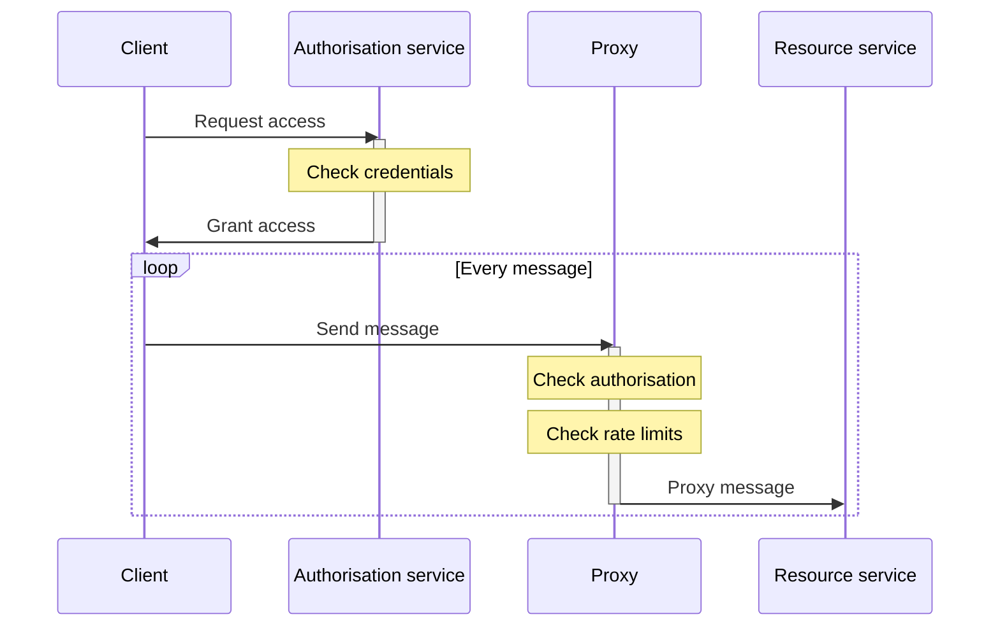

# Overview

## Objectives

- Minimum _Time to Mitigation_ (TTM): 1 second.

```mermaid
sequenceDiagram
    Client->>Authorisation service: Request access
    activate Authorisation service
    note over Authorisation service: Check credentials
    Authorisation service->>Client: Grant access
    deactivate Authorisation service
    
    loop Every message
        Client->>Proxy: Send message
        activate Proxy
        note over Proxy: Check authorisation
        note over Proxy: Check rate limits
        Proxy->>Resource service: Proxy message
        deactivate Proxy
    end
```
