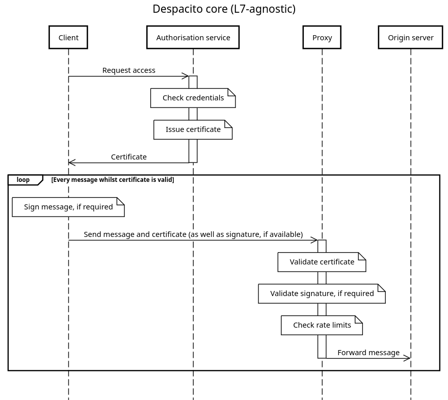

import { Aside } from '@astrojs/starlight/components';

<Aside type="caution">
  As you'll soon realise, this page and the rest of the website are work in progress.
</Aside>

_Despacito_ is the internal codename for a vendor-neutral,
DDoS-mitigating, application firewall protocol.
It's being designed by [Relaycorp](https://relaycorp.tech),
with a view to proposing it as an Internet Draft (I-D) to the IETF.
The purpose of this website is to gather feedback before drafting an I-D.

This protocol builds on the research we did for [The DDoS Report](https://ddos.report).
In fact,
Despacito packages many of the [recommended mitigations](https://ddos.report/mitigations/) into a coherent protocol,
requiring minimal input from app developers and operators.

## Introduction

Despacito is meant to be a pluggable mechanism inside
[reverse proxies](https://ddos.report/mitigations/reverse-proxies/).
It may always be active,
or only activated when the origin server is under heavy load
due to an attack or a legitimate traffic spike,
and/or the client is deemed suspicious.

When active,
Despacito provides the proxy with enough information about the client (e.g. user id, rate limits)
and the state of the origin server (e.g. current capacity),
so that the proxy can decide whether to allow a request.

To provide the proxy with information about the client,
Despacito introduces a new component,
which may be offered by the origin server itself or a third party:
An **authorisation service**,
responsible for authenticating the client and,
when authorisation is granted,
issuing a certificate that the client must use in all requests
as it contains everything the proxy needs.

## Decision factors

The proxy will consider the following factors when evaluating an incoming message
(e.g. HTTP request):

- **The client's identity** per the certificate issued by the authorisation server. For example:
  - Whether and how the client was [authenticated](https://ddos.report/mitigations/authentication/). If authenticated, a unique client id and the underlying user's id are included. The user id may be anonymised.
  - Which [cryptographic challenges](https://ddos.report/mitigations/crypto-challenges/) or [CHAPTCHAs](https://ddos.report/mitigations/captchas/) the client solved, if any.
  - Whether the client software is [trusted](https://ddos.report/mitigations/client-integrity/).
  - The client's [rate limits](https://ddos.report/mitigations/rate-limiting/).
- **The current capacity of the origin server**,
  as a float between 0.0 (idle) and 1.0 (at capacity), inclusive.
  This could be provided by the origin server itself,
  or the platform on which it's running
  (e.g. the `HorizontalPodAutoscaler` in Kubernetes, serverless products like Google Cloud Run).
  For example,
  if the autoscaling configuration allows for a minimum of 0 and maximum of 10 instances,
  and there are currently 5 instances running,
  the capacity is 0.5.
- **The current threat level**, as perceived by the operator of the origin server.
  For example, the operator might anticipate being the target of an attack following an event.
  The threat level is a float between 0.0 (no threat) and 1.0 (an attack is imminent), inclusive.

A fourth factor we're considering is the "cost" of processing that particular type of message
(e.g. HTTP request).

## Possible outcomes

Based on the factors above, the proxy will take one of the following actions:

- Forward the request to the origin server.
- Challenge the client to go back to the authorisation server
  and request a new authorisation with enhanced credentials.
  This may also be caused by a change in the origin server's capacity or threat level
  (we're aiming to have a _Time to Mitigation_ in the order of seconds).
- Reject the request with a `40X` status code, or equivalent in another Application Layer protocol.
- Terminate the TCP connection if there's a strong sign that the client is malicious,
  thus saving bandwidth.

## Example

The following diagram shows a high-level view of the Despacito protocol
when the client is allowed to communicate with the origin server.

On the other hand, the following diagram shows the same scenario when using HTTP.

## Environmental impact

TODO. Expand on the following:

- Minimise _Proof of Waste_.
- See: https://starlight.astro.build/environmental-impact/
